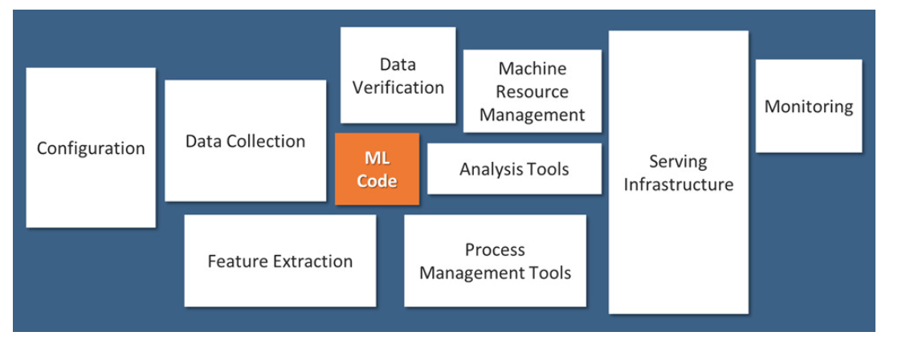
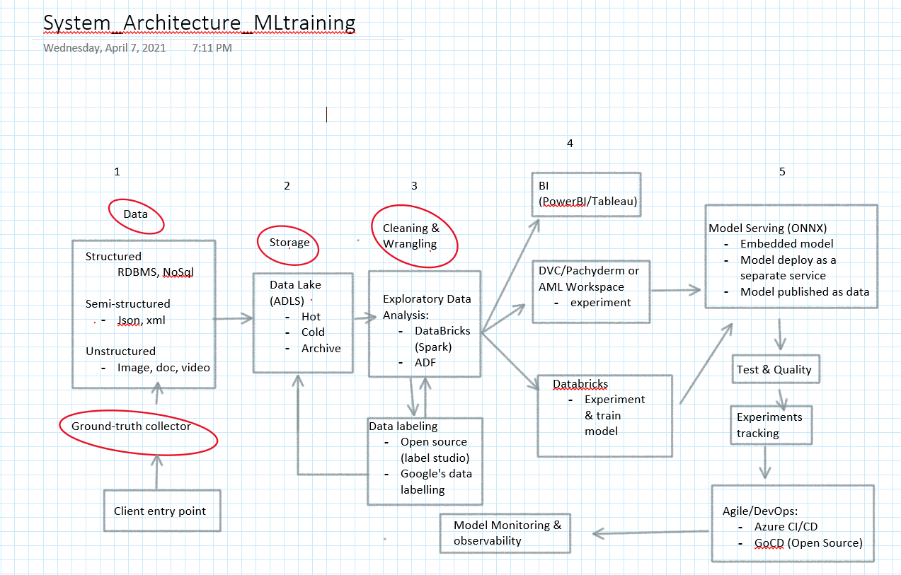
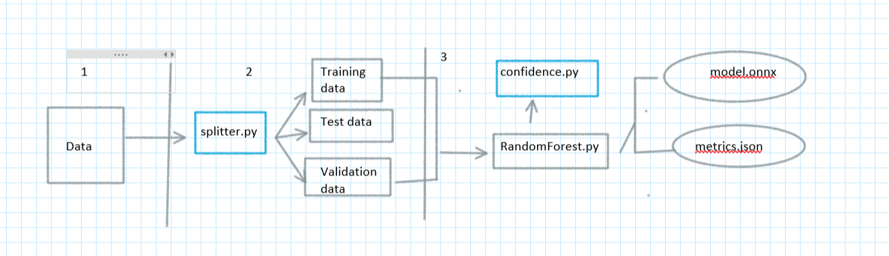
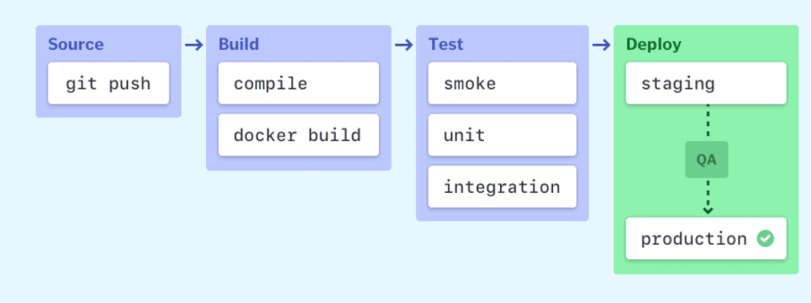

@sarit maitra

## System architecture of ML training platform

Here, I would like to highlight that, ML systems may come in many flavors. The way I'm presenting it may not match the expected experience of reader. However, this representation will give high level understanding and different component of ML workflow.

Before I present, must mention that in real-world ML systems, only a small fraction is comprised of actual ML code (Ref:1). Below image will give a better visibility of how small the coding part in the entire gammut of ML. 

The authors of the said reference are Google employees and there is a vast array of surrounding infrastructure and processes to support their evolution. They also discuss the many sources of technical debt that can accumulate in such systems, some of which are related to data dependencies, model complexity, reproducibility, testing, monitoring, and dealing with changes in the external world. I have mentioned the details of the reference in the end for easy access.

Below the system architecture I propose which is a combination of open source and Azure technologies. 

### Explanation with justofication:
Stages 1-3 are for scalable cloud data solution (storage and preprocessing)
 - During data labelling, I will have choices e.g. go either open souce (label studio) or dedicated (Google Data Labeling) which makes life easier. 
 - During EDA (exploratory data analysis), depending on use case we may choose Spark (realtime processing) or Azure Data Factory (gives us UI driven/less code option).

Assuming that, the data required to train useful ML models, will likely not be structured exactly the way we might need, therefore EDA is the first technical component: discoverabilty and accessibility of data. Regardless of whatever system architecture we develop, we want to ensure that data is easily docoverable and accessible to the stakeholders. 

Data versioning is a broad area but to summarize that, we need to have a simple approach to version our dataset based on the folder structure and file naming conventions.

### Data Pipelines
Though ETL like Azure Data Factpry (ADF) provides transformation and processing steps through a GUI, however, there are open source tools available too where we can define the data pipeline in code, which is easier to version control, test, and deploy. For Spark, we have the data pipeline written in Scala, which can be tested using using spark-testing-base, which can be packaged the job as a JAR artifact that can be versioned and deployed on a deployment pipeline in CI/CD.

Data Pipeline is either running as a batch job or as a long-running streaming application and can be potential source of integration issues if they change the output that either our model or our application expect. So, integration and contract test as part of deployment pipelines is useful to catch those mistakes.

### Reproducible Model Training:
Once data is available, the focus will be on iterative ML workflow of model development. This typically involves splitting the data into a training, test & a validation set, experimenting with different combinations of ML algorithms, and tuning their parameters and hyper-parameters for optimal performance. That produces a model which can be evaluated against the validation set, to assess the quality of its predictions. The step-by-step of this model training process becomes the ML pipeline.

Therefore, the above entire process involving data cleaning and pre-processing, data labeling, feature engineering, model and algorithm selection, model optimization and evaluation becomes ML pipeline. Avove  image is a high level overview of ML process. In general, the input data, the intermediate training, test and validation data sets, and the output model can potentially be large files and not advisable to store in the source control repository. Also, the stages of the pipeline are usually in constant change, which makes it hard to reproduce them outside of the ML engineer's local environment.

To formalize the model training process in code, we can use DVC(https://dvc.org/) which provides similar semantics and also solves few ML-specific problems. Once a suitable model is identified, we can treat it as an artifact which needs to be versioned and deployed to production. So, with DVC, we can use the dvc push and dvc pull commands to publish and fetch it from external storage. However, these rae use case driven and Azure MLflow defines a file format to specify the environment and the steps of the pipeline, and provides both an API and a CLI tool to run the project locally or remotely. I have kept the option open to use Databricks Spark which has in-memory faster data processing at scale.

Here, I would like to mention that, Azure Machine Learning(AML) is a framework allows us to train wherever we choose, then wrap the model as a web service in a docker container and deploy to any container orchestrator. Azure Databricks is a an optimized Apache Spark Platform for heavy analytics workloads. While Azure Databricks is a great platform to deploy AI Solutions (batch and streaming), I will often use it as the compute for training ML models before deploying with the AML Service (web service).

So, again, I kept the choices open instead of solely depending on one service and dending on use case, either of these can be availed. 

Next we come to model serving part.
### Model Serving:

So, we are satidfied with our model training, how can we serve and use the trained model in production environment?

There are 3 common patters:
 - embedded model which is a simpler approach where we treat the model artifact as a dependency that is built and packaged within the consuming application.
 - model deployed as a separate service where the model is wrapped in a service that can be deployed independently of the consuming applications.
 - model published as data where, the model is also treated and published independently, but the consuming application will ingest it as data at runtime.

I prefer ONNX to serve the model which provided language-agnostic exchange formats to share models. However, there are other tools like H20 which expors the model as POJO in Jar/Java library, which can then be added as a dependency in our application. 

However, regardless of which pattern we decide to use, to my experience, there is always an implicit contract between the model and its consumers. The model will usually expect input data in a certain shape, and if as a ML engineers, I change that contract or add new features, I will invite trouble which can cause integration issues and break the applications using it.Therefore, testing is an imminent part of ML training.

### ML testing:

Different types of testing can be introduced in the ML workflow. We must know that some aspects are inherently non-deterministic and hard to automate, there are many types of automated tests that can add value and improve the overall quality of ML system:
 - Data validation: we can add tests to validate input data against the expected schema, or to validate our assumptions about its valid values. Unit tests for engineered features to ensure they are calculated correctly.
 - Component integration validation: Contract Tests to validate that the expected model interface is compatible with the consuming application. Running the original and the productionized models against the same validation dataset, and comparing the results to ensure that the exported model still produces the same results.
 - Model bias validation: We can use Facets (tool) for this validation.

However, I always prefer to add some manual stages into the deployment pipeline, to display information about the model and allow people to decide if they should be promoted or not. This leads to a governance process and introduce checks for model bias, model fairness, or gather explainability information to understand how the model is behaving.

### Experiments Tracking
It is quite common that we will have multiple experiments being tried in parallel, and many of them might not ever make it to production. This experimentation approach during the research phase is different than a more traditional software development process, as we expect that the code for many of these experiments will be thrown away, and only a few of them will be deemed worthy of making it to production. From the CI automation perspective, we actually do want to train multiple models for each experiment, and gather metrics that will inform us which model can move to the next stage of the deployment pipeline. Both DVC and MLFlow provides an API and a web interface to visualize the multiple experiment runs, along with their parameters and performance metrics.

## CI/CD Orchestration:
Wnen we have all of the key building blocks in place, we need to tie everything together, and this is where our CI/CD orchestration. Eitherv we continue using Azure CI/CD or as usual, I choose to keep option open with GoCD (https://www.gocd.org/).

However, here, I must mention that, CI/CD pipeline may sound like overhead, but it isn’t really the fact. It is essentially a runnable specification of the steps that any software developer needs to perform to deliver a new version of a software product. In the absence of an automated pipeline, engineers would still need to perform these steps manually, and hence far less productively.

Let us understand the lements of CI/CD pipeline. Most software releases go through a couple of typical stages:

### Source stage
In most cases, CI/CD pipeline run is triggered by source code repository. Any change in code triggers a notification to the CI/CD tool, which runs the corresponding pipeline. Other common triggers include automatically scheduled or user-initiated workflows, as well as results of other pipelines.

We need to define a process for rollbacks in CI/CD, in case a deployed model turns out to perform poorly or incorrectly in production. 

### Build stage
When we combine the source code and its dependencies to build a runnable instance of our product that we can potentially deliver to our end users. Programs written in languages such as Java, C/C++, or Go need to be compiled, whereas Ruby, Python and JavaScript programs work without this step.

Regardless of the language, cloud-native software is typically deployed with Docker, in which case this stage of the CI/CD pipeline builds the Docker containers.

Failure to pass the build stage is an indicator of a fundamental problem in our project’s configuration, and it’s best to address it immediately.

### Test stage
Here, we run automated tests to validate our code and the behavior of our product. Test stage acts as a safety net that prevents easily reproducible bugs from reaching the end-users. In case of large-scale projects, the tests run in multiple stages, from smoke tests that perform quick sanity checks to end-to-end integration tests that test the entire system from the user’s point of view.

### Deploy stages
Once a runnable instance of our code has been built with all necessary tests, we’re ready to deploy it. The initial deploy environments is "staging" environment which is used internally by the product team, and finally a "production" environment for end-users. Agile model of development can be used here.

### Why AGILE is important here?
From my real-time experinece, it is quite imporssible to determine a specific timeline considering the involvement of applied research and exploratory work. Most DS projects require trial and error by going down different paths and trying different techniques. Therefore, Agile (SCRUM framework) is most suitable workflow for data science work. One important aspect to be noted here that, though AGILE approach provides more flexibility to clients; it givem them the opportunities to change their mind as the project develops. However, there is a trade-off; flexibility is costly in both time and money. Therefore, expectations need to be set at the begining.

## Model Monitoring and Observability
Collecting monitoring and observability data is important & critical when we have multiple models deployed in production. We can use EFK stack for monitoring and observability which comprises of:
 -  ElasticSearch
 -  FluentID
 -  Kibana

We can instrument our application code to log the model inputs and predictions as an event in FluentD. This event is then forwarded and indexed in ElasticSearch, and we can use Kibana to query and analyze it through a web interface.

To conclude, here, I have covered the system architecture and explained the choice of design. The designed system is highly scalable, maintainable and deployable. I have used combination of open source and dedicated (Azure) cloud technologies. However, to my knowledge, there is no one best way for all architectures and it all varies depends on business case and available resources. I have mentioned some of the open source tools like DVC, G0CD, ElasticSearch, FluentID, Kibana etc to use in tandem with Azure dedicated resources. We can use Kafka as well for data ingestion if in case we are ingesting streamed data. These tools that I have used in the past and found quite effective.

#### References:
  1. Sculley, D., Holt, G., Golovin, D., Davydov, E., Phillips, T., Ebner, D., ... & Dennison, D. (2015). Hidden technical debt in machine learning systems. Advances in neural information processing systems, 28, 2503-2511

   
